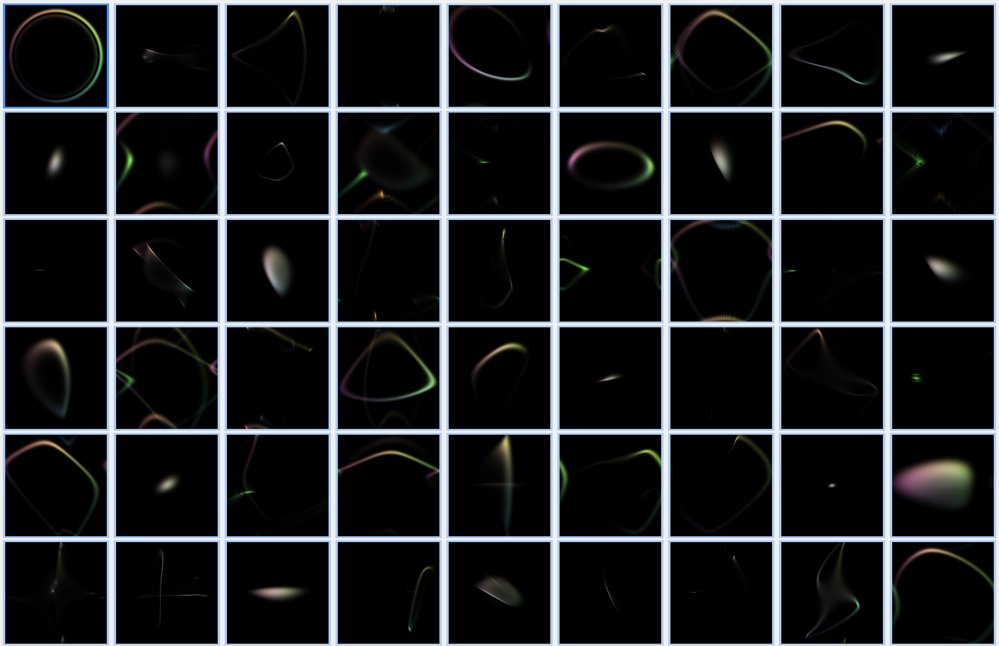
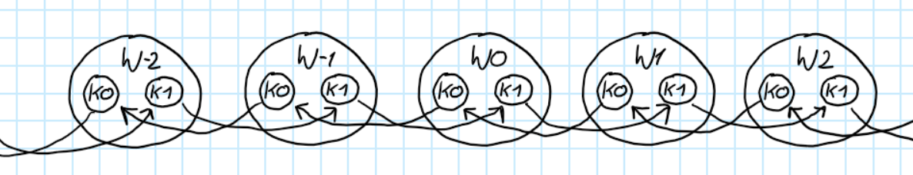
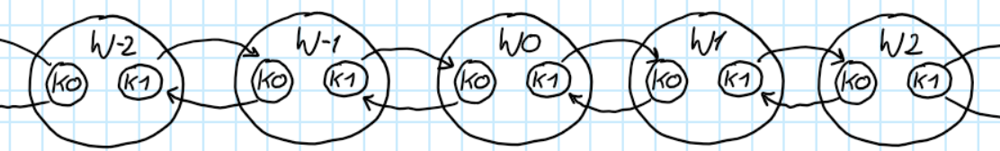
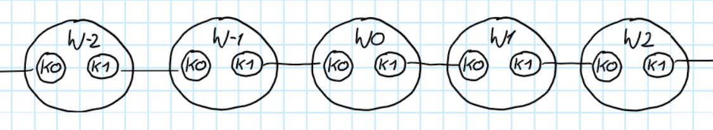
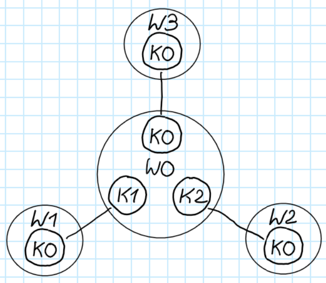
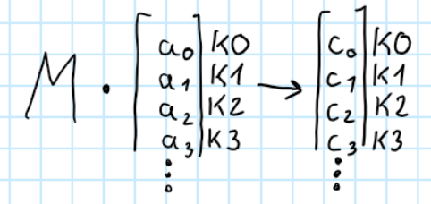

## Szybke spacerki losowe
W tym stanie nie będzie się kompilowć na innych systemach niż moim.
Gdyby komuś zależało na zkompliowaniu u siebie to proszę o kontakt. 

  

  

## [Algorytm szybkiego spacerku losowego](./algorytm_szybkiego_spacerku_losowego.md)
Dużo bawiłem się w zrobienie tego, aby ewolucja spaceru losowego była szybka.
I uważam że, zrobienie coś znacząco szybszego niż ja zrobiłem, będzie trudne, jeśli nie niemożliwe.

## Ogólne informacje
### Kolejność operacji w iteracji spaceru
1. Mieszanie w wierzchołku(operator monety)
2. Wysłanie do docelowych kubełków(operator przesunięcia)
3. Absorbcja z podanych kubłeków(opcjonalne usuwanie prawdopodobieństwa)

### Różne operatory monety
Fizycy lubią używać jednego operatora monety na wszystkich wierzchołkach. Mogą też wtedy, zapisać globalny operator jako, $iloczynkronekera(operator perzesuniecia, operator monety)$.
Natomiast przestaje to działać, gdy jakiś wierzchołek jest innego stopnia.
Dlatego w mojej implementacji każdy wierzchołek ma swój własny operator monety.
Może to być ten sam operator w każdym, jeśli każdy wierzchołek ma ten sam stopień.

### Inny operator przesunięcia niż normalny
Grafy na których licze rzeczy trochę się różnią operatorem przesunięcia.
Klasyczna definicja operatora przesunięcia nie działa dobrze dla dowolnego grafu. 
W przypadku dla lini fizycy by chcieli:

  

Wtedy dla mieszacza prawdopodobieństwa identycznościowego, prawdopodobieństwo przemieszcza się, ze ze stała prędkością.
Ja natomiast używam takiego grafu:

  

Teraz dla mieszacza identycznościowego, prawdopodobieństwo prawie, że stoi w miejscu.
I mogę graf przedstawić za pomocą krawędzi nieskierowanych:

  

Obydwie definicje operatora mogą robić to samo, przy odpowiedniej permutacji wejść lub/i wyjść funkcji mieszania prawdopodobieństwa na wierzchołkach.
Konwencja, że kierunek prawdopodobieństwa ma być zachowany, nie działa dobrze dla dowolnego grafu. Weźmy za przykład graf:

  

I pytanie jest jak zdefiniować przejścia prawdopodobieństwa między kubełkami, aby "zachowywało swój kierunek"?

Uważam, że nie istnieje algorytm rozwiązujący to zagadnienie dla dowolnego grafu. Proponuje się nie zastanawiać nad tym. Po prostu dać krawędzie nieskierowane i zostawić takie rozważania do operatora monety na wierzchołku.

  

### Kolejność argumentów mieszacza prawdopodobieństwa
Definicja połączeń między kubełkami wpływa na kolejność argumentów. Weźmy przypadek dla macierzy.
Zdarzyło się, że zastanawiałem się dlaczego mam inne wyniki niż kolega.
Okazało się, że macierz operatora monety dostawała i zwracała inną permutacje wartości w kubełkach.
Więc jest to ważne. U mnie na wierzchołku działa to następująco:

  

## Uwagi nazewnictwowe:
- kubełek i kierunek oznaczają praktycznie to samo
- transformer fizycy nazwali by operatorem, albo operatorem monety, ale operator jest zarezerwowanym keywordem w c++, więc używam nazwy transformer, albo transformata
- towar to jest zawartość kubełka
- template typ zawartości kubełka nazywa się towar
- template typ operatora mieszającego nazywa się transformata

## Dla tych co c++ nie znają, ale kod chcą poczytać:
Zakładam, że Pythona znasz. c++ nie różni się dużo składniowo od Pythona.
Poniżej zapisałem podobieństwa i różnice między językami które mam nadzieje pozowlą ci zrozumieć kod na podstawie znajomości Pythona.

### \{\} zamiast wcięć po : 

### Wszędzie na końcu jest ;
W Pythonie też tak można, tu jednak jest to konieczne.

### Wszędzie jest stały typ, poza miejscami gdzie typ jest "zmienny"
Zmienne w c++ mają zdefiniowany stały typ. Jest jednak mechanizm operowania na typach, tak że udaje zmienne typy.
Nazywa się on template. Podczas kompilacji i tak są stałe typy. Rzeczy związane z tym mechanizmem są w nawiasie <>.
Silnie z niego korzystam w structcie spacer_losowy, aby na raz mógł obsługiwać najwięcej typów spacerów losowych na podstawie argumentów templateowych.
Template zawartości kubełka nazywa się towar. Template operatora mieszającego nazywa się transformata. 

### Troche inne fory
| Python | c++ |
| :-: | :-: |
| for i in X | for(auto& i : X) |
| for i in range(n, m, k) | for(int i = n; i < m; i += k) |

## Szczegóły techniczne projektu
Warningi ze wszystkich plików źródłowych z grafiki komputerowej są ignorowane(zrobione w solution explorer albo/i #pragma). I wszystkie warningi w plikach cpp w folderze są zdisablowane.

