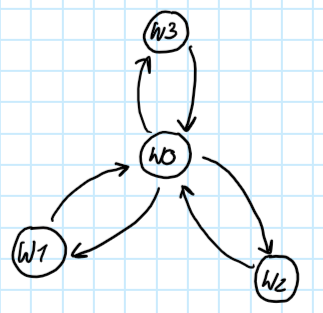
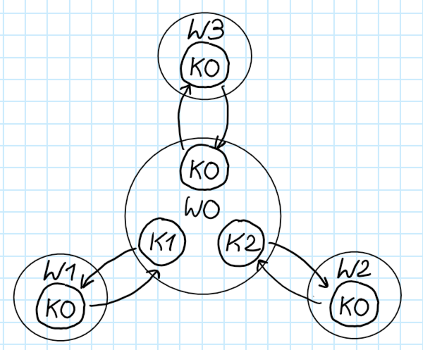
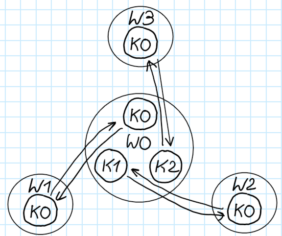
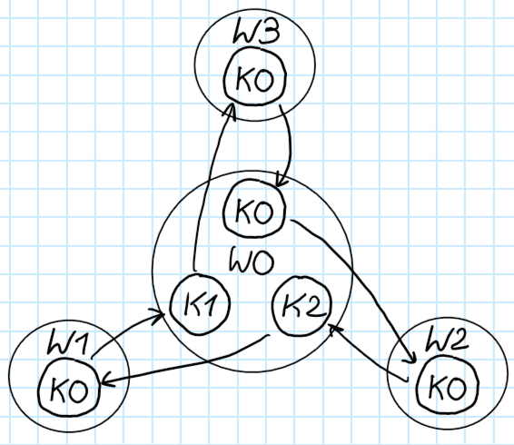
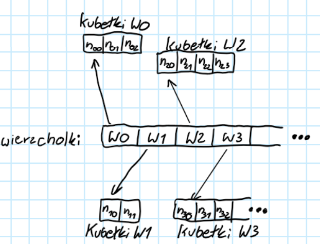
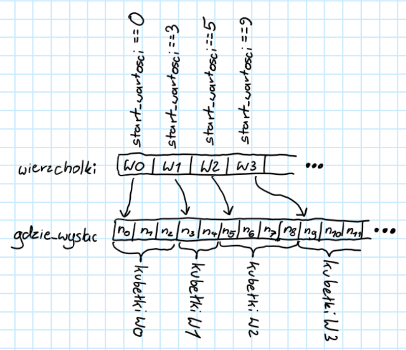

# Algortym Szybkich Spacerków Losowych
## Założenia przy tworzeniu algorytmu:
 - Działa dla dowolnego grafu skierowanego zrównoważonego
   (każdy wierzchołek ma ten sam stopień wejściowy i wyjściowy)
 - Działa dla spacerów klasycznych i kwantowych
 - Da się liczyć wielowątkowo
 - Da się zrobić kwantowe ciągłe i dyskretne
 - Opcja absorbowania(usunięcia prawdopodobieństwa) w każdej iteracji z danej pozycji i zapamiętanie ile zaabsorbowało.
## Graf inicjalizacyjny

Spacer losowy jest inicjalizowany grafem skierowanym zrównoważonym.
Zrównoważonym oznacza, że każdy wierzchołek ma tą samą liczbe krawędzi wychodzącą i przychodzącą.
Co więcej graf inicjalizacyjmy musi mieć śledzone indeksy krawędzi przychodzących. 
Na grafie poniżej zaprezentuje dlaczego jest to ważne.

  

Na podstawie rysunku powyżej możemy przeczytać trochę potrzebnych informacji.
Znamy teraz ile funkcja mieszająca prawdopodobieństwo na wierzchołku będzie mieć argumentów wejścia i wyjścia.
Własnością implementacji jest to, że musi być tyle samo wejść i wyjść.

"Mieszacz prawdopodobieństwa"$(\R^n) \leftarrow \R^n $

| Wierzchołek | n |
| :---------: |:-:|
| W0 | 3 |
| W1 | 1 |
| W2 | 1 |
| W3 | 1 |

Nie są to jednak wszystkie potrzebne informacje o grafie.
Dla wygody kontroli indeksów wejść i wyjść funkcji, graf inicjalizacyjny musi mieć informacje o kubełkach.
Spójrzmy na ten sam graf w 3 różnych widokach kubełkowych:

  
  
  

Można użyć na tych 3 grafach tych samych mieszaczy prawdopodobieństwa.
Jednak ewolucja w czasie dla każdego z nich może być różna.
Da się zrobić, aby były takie same za pomocą odpowiednich permutacji w mieszaczach prawdopodobieństwa.
Tylko wciąż przydały by się kontrolki tego jak kubełki są połączone.
Przypominam, że każdy kubełek musi mieć jedno wejście i wyjście.

## Budowa Struktury Danych - dane trwałe

Spacer losowy podzielony został na rzeczy trwałe i zmienne. Dane trwałe *([kod](.\spacer_losowy.h))* w trakcie iterowania mają być readonly.
Zmienne dane są read-write w procesie iteracji. 

### Wierzchołek

Co wie o sobie wierzchołek? *([kod](.\spacer_losowy.h))*
 - Jaki jest jego mieszacz prawdopodobieństwa (**transformer**)
 - Jakie są jego wartości w kubełkach (**start_wartosci**)
 - Gdzie dane kubełeki wskazują (**start_wartosci**)

 (dla powyższych w implementacji pola wierzchołka mówią gdzie znaleźć te informacje, a nie bezpośrednio jakie są te rzeczy)

- Ile ma kubełków (**liczba_kierunkow**)

### Dane trwałe 

Struct **dane_trwale** *([kod](.\spacer_losowy.h))* agreguje wszystkie dane trwałe potrzebne do iterowania:
1. **wierzcholki** - lista wszystkich wierzchołków w spacerze, $rozmiar(wierzcholki) == liczba wierzcholków w grafie$
2. **transformaty** - przechowuje transformaty(mieszcze prawdopodobieństwa) używane w wierzchołkach
3. **gdzie_wysylac** - gdzie_wysylac[globalny indeks kubełka] == globalny indeks kubełka do wysłania po zastosowaniu transformaty
4. **znajdywacz_wierzcholka** - Każdy wątek przychodzi tutaj ze swoim unikatowym indeksie i wie na podstawie **info_prawcownika** na którym wierzchołku ma pracować
5. **indeksy_absorbowane** - lista indeksów KUBEŁKÓW z których jest absorbowane

### Agregacja do jednego ciągu pamięci
Wierzchołki wskazują na informacje np. gdzie kubełki mają wysłyłać prawdopodobieństwo.
Te informacje muszą gdzieś istnieć w pamięci komputera. Generalnie każdy wierzchołek mógłby mieć osobny kawałek pamięci.

  

Jednak jedna duża globalna lokalizacja pamięci jest lepsza.

  

#### Takie ułożenie pozwala mi na usprawnienia:
1. Mogę przesyłać dane między GPU-CPU przy użyciu jednego dużego memcpy
2. Wskaźniki w wierzchołkach do pamięci kubełka mogą być wględne względem początka **gdzie_wysylac**, Nie muszę wtedy poprawiać wszystkich wskaźników bo na GPU adresy są inne niż na CPU.
3. Mała fragmentacja pamięci

#### Możliwe wady:
1. Gdyby ktoś chciał dołożyć kubełków do wierzchołka to nie będzie to proste

## Dane iteracji
Instancja structa **[dane_iteracji](.\spacer_losowy.h)** zawiera całą informację spaceru losowego w pewnym czasie.
Składa się z:
- **wartosci**, wektor stanu spaceru losowego. rozmiar(wartosci) == liczba kubełków
- **wartosci_zaabsorbowane**, prawdopodobieństwo zaabsorbowane. rozmiar(wartosci_zaabsorbowane) == rozmiar(indeksy_absorbowane)
- **czas**

I kilku pól do agregacji danych. Te pola używane są przy spacerze ciągłym w czasie do renormalizacji.
- **prawdopodobienstwo_poprzedniej**
- **zaabsorbowane_poprzedniej**
- **norma_poprzedniej_iteracji**

### Naprzemienne iterowanie
Zaimplementowy przeze mnie spacer losowy do policzenia stanu po jakimś czasie nie mallokuje nowej pamięci.
Otrzymane jest to przez przerzucanie bieżączej iteracji między dwoma lokalizacjami: **[iteracjaA](.\spacer_losowy.h)**, **[iteracjaB](.\spacer_losowy.h)**.

| Iteracja | stan poprzedni | stan następny |
| :---------: |:-:|:-:|
| 1 | A | B | 
| 2 | B | A | 
| 3 | A | B | 
| 4 | B | A |
|...|...|...|

Iteracja poprzednia jest readonly, żaden wątek nie ma prawa jej modyfikować.
Iteracje następną można czytać i modyfikować, ale trzeba to robić w sposób odpowiedni dla wielowątkowości, zazwyczaj do jest po prostu pisane.
Dane popoprzedniej iteracji są nadpisywane. Aby zapisać dane iteracji, na stanie poprzednim w czasie liczanie następnego, robi się cudaMemcpyAsync().

## Kolejność podczas liczenia następnej iteracji

Aby policzyć następny stan należy wykonać operacje, których kolejność ma znaczenie:
 - użycie mieszacza prawdopodobieństwa
 - przesunięcie między kubłekami
 - absorbcja (jeśli chciane) 
 - zapamiętać iteracje (jeśli chciane)
 - policzyć skalar normalizacji (jeśli chciane)
W implementacji mieszanie prawdopodobieństwa i przesuniecie między kubełkami jest jedną operacją. Wątek od razu robi, obydwa na raz.
Jest też funkcja dokoncz_iteracje(), która powoduje przejście do kolejnej iteracji.

### Na CPU
Kolejność to:
1. __transformata i przesłanie między kubełkami__ **[spacer_losowy.iteracja_na_cpu()](.\spacer_losowy.h)**
2. __absorbcja__, jeśli chciana **[spacer_losowy.absorbuj_na_cpu(1.0)](.\spacer_losowy.h)**, jeśli nie **[spacer_losowy.absorbuj_na_cpu(0.0)](.\spacer_losowy.h)**
3. policz dane do __normalizacji__, jeśli chciana **[spacer_losowy.policz_wspolczynnik_normalizacji()](.\spacer_losowy.h)**, jeśli nie to **[spacer_losowy.nie_normalizuj()](.\spacer_losowy.h)**
4. jeśli, chcesz __zapisać__ iteracje to **[spacer_losowy.zapisz_iteracje()](.\spacer_losowy.h)**
5. **[spacer_losowy.dokoncz_iteracje(dt)](.\spacer_losowy.h)**

Przykładowe użycie:
'''c++

	for (uint64_t i = 0; i < liczba_iteracji; i++) {
		spacer_cpu.iteracja_na_cpu();
		if(i % co_ile_absorbuj == 0){
			spacer_cpu.absorbuj_na_cpu(1.0);
		} else {
			spacer_cpu.absorbuj_na_cpu(0.0);
		}
		if (i % co_ile_normalizuj == 0) {
			spacer_cpu.policz_wspolczynnik_normalizacji();
		} else {
			spacer_cpu.nie_normalizuj();
		}
		if(i % co_ile_zapisac == 0){
			spacer_cpu.zapisz_iteracje();
		}
		spacer_cpu.dokoncz_iteracje(dt);
	}
'''

### Na GPU
Tutaj jest trudniej, bo chcemy korzystać z wielowątkowości. Wykorzystywane są 3 strumienie asynchroniczne:
**stream_iteracja**, **stream_normalizacja**, **stream_pamiec_operacje**.

| krok | **stream_iteracja** | **stream_normalizacja** | **stream_pamiec_operacje** |
| :-: | :---------: |:-:|:-:|
| 1 | iteracja_na_gpu() | gpu_P_sumator.sumuj() | spacer.zapisz_iteracje_z_cuda() |
| 2 | absorbuj_na_gpu() | gpu_sumator.sumuj() | |
| 3 | zakoncz_iteracje() | policz_wspolczynnik_normalizacji() | |

Na końcu należy jeszcze zsynchronizować wszystkie strumienie.

Przykładowe użycie:
'''c++

	for(uint32_t i = 0; i < liczba_iteracji; i++){		
		//Wskazniki poprawne na GPU
		spacer::dane_iteracji<towar>* iteracja_z = &(spacer.lokalizacja_na_device->iteracjaA);
		spacer::dane_iteracji<towar>* iteracja_do = &(spacer.lokalizacja_na_device->iteracjaB);
		if (spacer.A == false) {
			iteracja_z = &(spacer.lokalizacja_na_device->iteracjaB);
			iteracja_do = &(spacer.lokalizacja_na_device->iteracjaA);
		}
		spacer::dane_trwale<transformata>* trwale = &(spacer.lokalizacja_na_device->trwale);

		iteracja_na_gpu<towar, transformata>start_kernel(przydzielacz_iteracja, 0, spacer.stream_iteracja)(
			trwale, iteracja_z, iteracja_do, przydzielacz_iteracja);
		if(i % co_ile_normalizuj == 0) {
			sumator_P.sumuj(spacer.iteracja_z()->wartosci, &(iteracja_do->prawdopodobienstwo_poprzedniej), spacer.stream_normalizacja);
			sumator.sumuj(spacer.iteracja_z()->wartosci_zaabsorbowane, &(iteracja_do->zaabsorbowane_poprzedniej), spacer.stream_normalizacja);
			policz_wspolczynnik_normalizacji<towar><<<1, 1, 0, spacer.stream_normalizacja>>>(iteracja_z, iteracja_do, spacer.trwale.poczatkowe_prawdopodobienstwo);
		} else {
			nie_normalizuj<towar><<<1, 1, 0, spacer.stream_normalizacja>>>(iteracja_z, iteracja_do);
		}
		if(i % co_ile_zapisac == 0){
			spacer.zapisz_iteracje_z_cuda();
		}

		if(i % co_ile_absorbuj == 0){
			absorbuj_na_gpu<towar, transformata>start_kernel(przydzielacz_absorbcja, 0, spacer.stream_iteracja)(
				trwale, iteracja_z, iteracja_do, 1.0, przydzielacz_absorbcja);
		} else {
			absorbuj_na_gpu<towar, transformata>start_kernel(przydzielacz_absorbcja, 0, spacer.stream_iteracja)(
				trwale, iteracja_z, iteracja_do, 0.0, przydzielacz_absorbcja);
		}
		spacer.dokoncz_iteracje(delta_t);
		zakoncz_iteracje<towar, transformata><<<1, 1, 0, spacer.stream_iteracja>>>(iteracja_do, spacer.iteracja_z()->czas);

		sprawdzCudaErrors(cudaStreamSynchronize(spacer.stream_iteracja));
		sprawdzCudaErrors(cudaStreamSynchronize(spacer.stream_normalizacja));
		sprawdzCudaErrors(cudaStreamSynchronize(spacer.stream_pamiec_operacje));
		sprawdzCudaErrors(cudaGetLastError());

	}
'''
Albo po prostu użyć **[iteracje_na_gpu()](.\spacer_losowy.cu)**.

## Ograniczenie prędkości
W tym momencie(20.02.2026) oprogramowanie liczy 50000 iteracji:

spaceru kwantowego ciągłego w czasie(renormalizacja w każdej iteracji)

na grafie kraty 2D 501x501,

ta sama transformata na wszystkich wierzchołkach,

w ~20 sekund.

Myślę, że jest to blisko możliwej granicy dla sprzętu stosując to podejście. Sprzęt na którym liczę to rtx3070. 
Teoretyczny limit ([speki GPU](https://www.techpowerup.com/gpu-specs/geforce-rtx-3070.c3674)):
	
### Liczba operacji zmiennoprzecinkowych
Jedna iteracja wymaga $501*501$ mnożeń macierzy 4x4 razy wektor.

ilość mnożeń liczb zespolonych: $501*501*4*4$
ilość dodawań liczb zespolonych: $501*501*3*4$

ilość mnożeń double: ~$501*501*4*4*4=16MFLO$
ilość dodawań double: $501*501*3*4*2$

ilość mnożeń i dodawań double przy normalizacji: ~$501*501*4*2$

Mnożeń jest najwięcej i są wolniejsze, więc zignorujmy liczbe dodawań.

Czyli do policzenia 50000 iteracji potrzeba: $501*501*4*4*4*50000=803 GFLO$

Skoro liczy się przez 20s to używa średnio około: $803 GFLO / 20s = 40 GFLOPS$. Moje GPU w spekach ma  $300 GFLOPS$.
W tym aspekcie może, by się dało maksymalnie 7.5 razy szybciej policzyć.

### Prędkość pamięci
Powiedzmy, że jedna iteracja wymaga przesłania z pamięci całej struktury danych spaceru_losowego. Krata wymaga $501*501*4$ liczb zespolonych. 
Jest to $501*501*4*2*8=16MB$ pamięci. Na rozmiar całego spaceru pomnożenie razy 3 powinno to sensownie aproksymować.

Rozmiar całego spaceru: $~50MB$.

Czyli, aby policzyć 50000 iteracji trzeba przeżucić: $50000*50MB=2.5TB$

Skoro liczy się przez 20s to używa średnio około: $2.5TB / 20s = 125GB/s$. Moje GPU w spekach ma  $450GB/s$.
W tym aspekcie może, by się dało maksymalnie 3.5 razy szybciej policzyć.

Poziom wykorzystania VRAM w trakcie liczenia wynosi ~0.05MB.
Można o wiele większe policzyć i dopuki starcza VRAM powinno ładnie liniowo skalować się z rozmiarem.

